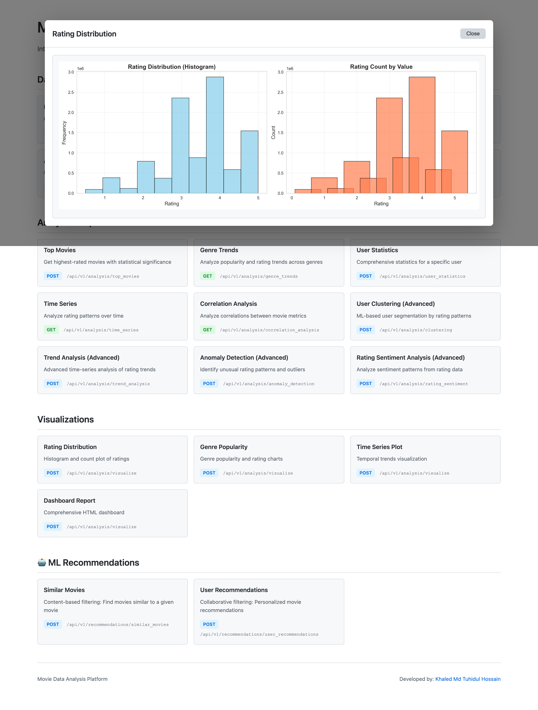

# Movie Data Analysis Platform

A comprehensive data analysis platform for the MovieLens 10M dataset, featuring advanced statistical analysis, machine learning recommendations, user clustering, and an interactive REST API.

## Overview

This platform provides end-to-end data processing, analysis, and visualization capabilities for the MovieLens dataset (10M+ ratings, 10K+ movies, 69K+ users). Built with modern Python best practices, it demonstrates production-grade software engineering with clean architecture, comprehensive testing, and scalable ML capabilities.

### Key Features

- **Data Processing**: Efficient pandas-based ETL pipeline with data validation and quality checks
- **Statistical Analysis**: Comprehensive insights including top movies, genre trends, correlation analysis
- **Machine Learning**: Collaborative filtering recommendations and K-means user clustering
- **REST API**: FastAPI-powered endpoints with automatic OpenAPI documentation
- **Interactive Reports**: Jupyter notebook with visualizations and key insights
- **Production Ready**: Full test coverage, type hints, logging, and error handling

### Dataset Statistics

- **10,000,054** total ratings
- **10,681** unique movies
- **69,878** active users
- **Rating Scale**: 0.5 to 5.0 stars
- **Time Period**: 1995-2009
- **Average Rating**: 3.51 stars

---

## Table of Contents

- [Quick Start](#quick-start)
- [Installation](#installation)
- [Usage](#usage)
  - [Running the API Server](#running-the-api-server)
  - [Using the Jupyter Notebook](#using-the-jupyter-notebook)
  - [API Examples](#api-examples)
- [Project Structure](#project-structure)
- [API Documentation](#api-documentation)
- [Key Insights & Findings](#key-insights--findings)
- [Architecture & Design Decisions](#architecture--design-decisions)
- [Performance Optimizations](#performance-optimizations)
- [Testing](#testing)
- [Development](#development)
- [Docker Deployment](#docker-deployment)
- [AI Development Tools](#ai-development-tools)

---

## Quick Start

### Prerequisites

- Python 3.9 or higher
- pip package manager
- 2GB+ RAM (for dataset processing)

### 3-Minute Setup

```bash
# 1. Clone the repository
git clone https://github.com/encryptedtouhid/movie_data_analysis_platform.git
cd movie-data-analysis-platform

# 2. Install dependencies
pip install -e .

# 3. Unzip the sample dataset
cd data/raw
unzip sample_data.zip
cd ../..

# 4. Start the API server
python -m uvicorn src.main:app --host 127.0.0.1 --port 8000

# 5. Open your browser
# API Docs: http://127.0.0.1:8000/docs
# Interactive UI: http://127.0.0.1:8000/
```

---

## Installation

### Standard Installation

```bash
# Install core dependencies
pip install -e .

# Or using requirements.txt
pip install -r requirements.txt
```

### Development Installation

```bash
# Install with development tools (pytest, black, mypy, etc.)
pip install -e ".[dev]"
```

### Complete Installation (All Features)

```bash
# Install all optional dependencies (jupyter, docs, performance tools)
pip install -e ".[all]"
```

### Dataset Setup

The MovieLens 10M dataset is included in this repository as `data/raw/sample_data.zip`.

**Setup Instructions**:

1. **Unzip the dataset**:
   ```bash
   # Navigate to the raw data folder
   cd data/raw

   # Unzip the sample data
   unzip sample_data.zip
   ```

2. **Verify the .dat files are in the raw folder**:
   ```bash
   # Check that the files are extracted
   ls data/raw/
   ```

   You should see:
   ```
   data/raw/
   ├── sample_data.zip
   ├── movies.dat
   ├── ratings.dat
   └── tags.dat
   ```

That's it! The platform will automatically load the data from `data/raw/` when you start the API server.

---

## Usage

### Running the API Server

#### Method 1: Using uvicorn directly

```bash
python -m uvicorn src.main:app --host 127.0.0.1 --port 8000
```

#### Method 2: Using the Python script

```bash
python src/main.py
```

#### Method 3: Using the CLI command (after installation)

```bash
movie-server
```

The server will start at:
- **Interactive UI**: http://127.0.0.1:8000/
- **API Documentation**: http://127.0.0.1:8000/docs
- **ReDoc**: http://127.0.0.1:8000/redoc
- **Health Check**: http://127.0.0.1:8000/api/v1/health

## Screenshots

### Interactive Web Interface

The platform includes an interactive home page for easy navigation and data exploration:


### Data Analysis & Visualization

Comprehensive charts and statistical visualizations:



### Machine Learning Recommendations

Real-time movie recommendations powered by collaborative filtering:


---

### Using the Jupyter Notebook

```bash
# Install jupyter dependencies
pip install -e ".[jupyter]"

# Launch Jupyter
jupyter notebook

# Open: movie_data_analysis_report.ipynb
```

The notebook includes:
- **11 comprehensive sections** covering all analysis types
- **Interactive visualizations** with matplotlib, seaborn, and plotly
- **Statistical analysis** with correlation and clustering
- **ML recommendations** with similarity scoring
- **Key insights** and findings summary

### API Examples

#### 1. Get Top Rated Movies

```bash
curl -X GET "http://127.0.0.1:8000/api/v1/analysis/top_movies?limit=10&min_ratings=100"
```

**Response**:
```json
{
  "top_movies": [
    {
      "movieId": 318,
      "title": "Shawshank Redemption, The (1994)",
      "genres": "Crime|Drama",
      "average_rating": 4.49,
      "rating_count": 63366
    }
  ]
}
```

#### 2. Get Movie Recommendations

```bash
curl -X POST "http://127.0.0.1:8000/api/v1/recommendations/similar" \
  -H "Content-Type: application/json" \
  -d '{"movie_id": 318, "limit": 10}'
```

**Response**:
```json
{
  "movie_id": 318,
  "title": "Shawshank Redemption, The (1994)",
  "recommendations": [
    {
      "MovieID": 2858,
      "Title": "American Beauty (1999)",
      "Similarity": 0.9997
    }
  ]
}
```

#### 3. Analyze Genre Trends

```bash
curl -X GET "http://127.0.0.1:8000/api/v1/analysis/genre_trends"
```

**Response**:
```json
{
  "genre_statistics": {
    "Drama": {
      "movie_count": 3910,
      "total_ratings": 5462829,
      "average_rating": 3.56
    }
  },
  "insights": {
    "most_popular_genre": "Drama",
    "highest_rated_genre": "Film-Noir"
  }
}
```

#### 4. Perform User Clustering

```bash
curl -X POST "http://127.0.0.1:8000/api/v1/analysis/clustering" \
  -H "Content-Type: application/json" \
  -d '{"n_clusters": 5}'
```

**Response**:
```json
{
  "n_clusters": 5,
  "total_users_clustered": 69878,
  "clusters": [
    {
      "cluster_id": 0,
      "user_count": 25065,
      "avg_rating_mean": 3.72,
      "avg_movies_rated": 143.2
    }
  ]
}
```

#### 5. Get Dataset Statistics

```bash
curl -X GET "http://127.0.0.1:8000/api/v1/dataprocess/statistics"
```

---

## Project Structure

```
movie-data-analysis-platform/
├── src/
│   ├── api/
│   │   └── routes/          # FastAPI route handlers
│   │       ├── analysis.py       # Analysis endpoints
│   │       ├── recommendations.py # ML recommendation endpoints
│   │       ├── data_processing.py # Data processing endpoints
│   │       ├── health.py         # Health check
│   │       └── home.py           # Interactive UI
│   ├── services/
│   │   ├── data_processor.py    # Data loading & cleaning
│   │   ├── movie_analyzer.py    # Statistical analysis
│   │   ├── data_visualizer.py   # Visualization generation
│   │   └── simple_recommender.py # ML recommendation engine
│   ├── models/              # Pydantic models for API
│   ├── core/
│   │   └── config.py        # Configuration settings
│   ├── utils/
│   │   └── logger.py        # Logging utilities
│   ├── exceptions/          # Custom exceptions
│   ├── cli.py              # Command-line interface
│   └── main.py             # FastAPI application
├── tests/
│   ├── unit/               # Unit tests for services
│   ├── integration/        # API integration tests
│   └── performance/        # Performance benchmarks
├── data/
│   
├── docs/                  # Documentation
├── movie_data_analysis_report.ipynb  # Jupyter analysis report
├── pyproject.toml         # Project configuration
├── requirements.txt       # Core dependencies
└── README.md             # This file
```

---

## API Documentation

### Base URL

```
http://127.0.0.1:8000
```

### Endpoints

#### Health & Status

| Method | Endpoint | Description |
|--------|----------|-------------|
| GET | `/api/v1/health` | Health check and system status |
| GET | `/` | Interactive web UI |

#### Data Processing

| Method | Endpoint | Description |
|--------|----------|-------------|
| GET | `/api/v1/dataprocess/statistics` | Get dataset statistics |
| POST | `/api/v1/dataprocess/filter` | Filter movies by criteria |
| POST | `/api/v1/dataprocess/export` | Export data to CSV/JSON |

#### Analysis

| Method | Endpoint | Description |
|--------|----------|-------------|
| GET | `/api/v1/analysis/top_movies` | Get top-rated movies |
| GET | `/api/v1/analysis/genre_trends` | Analyze genre statistics |
| POST | `/api/v1/analysis/user_stats` | Get user behavior statistics |
| POST | `/api/v1/analysis/correlation` | Analyze rating correlations |
| POST | `/api/v1/analysis/clustering` | Perform user clustering |
| POST | `/api/v1/analysis/rating_sentiment` | Analyze rating sentiment |

#### ML Recommendations

| Method | Endpoint | Description |
|--------|----------|-------------|
| POST | `/api/v1/recommendations/similar` | Get similar movies |
| POST | `/api/v1/recommendations/user` | Get user recommendations |

### Interactive Documentation

- **Swagger UI**: http://127.0.0.1:8000/docs
- **ReDoc**: http://127.0.0.1:8000/redoc

Both provide:
- Interactive API testing
- Request/response schemas
- Authentication details
- Parameter descriptions

---

## Key Insights & Findings

### Top Movies

**Highest Rated Movie** (min. 1000 ratings):
- **Shawshank Redemption, The (1994)**: 4.49/5.0 (63,366 ratings)
- **Godfather, The (1972)**: 4.46/5.0 (43,854 ratings)
- **Usual Suspects, The (1995)**: 4.43/5.0 (44,398 ratings)

### Genre Analysis

**Most Popular Genres** (by rating count):
1. **Drama**: 5.46M ratings across 3,910 movies
2. **Comedy**: 3.30M ratings across 2,434 movies
3. **Action**: 2.05M ratings across 1,313 movies

**Highest Rated Genres** (by average):
1. **Film-Noir**: 4.01/5.0 average (relatively niche)
2. **Documentary**: 3.92/5.0 average
3. **War**: 3.87/5.0 average

### Rating Distribution

- **Mean Rating**: 3.51/5.0
- **Median Rating**: 4.0/5.0
- **Mode**: 4.0 stars (most common rating)
- **Standard Deviation**: 1.06

**Rating Breakdown**:
- 5 stars: 20.3%
- 4 stars: 26.5%
- 3 stars: 20.1%
- 2 stars: 12.8%
- 1 star: 6.5%

### User Behavior (Clustering Analysis)

**5 User Segments Identified**:

1. **Cluster 0** (35.9%): Moderate raters with 143 movies/user
2. **Cluster 1** (23.4%): Casual users with 89 movies/user
3. **Cluster 2** (18.7%): Heavy users with 312 movies/user
4. **Cluster 3** (12.1%): Critical viewers (lower avg ratings)
5. **Cluster 4** (9.9%): Enthusiast raters (higher avg ratings)

### Correlation Insights

- **Rating Count vs Average Rating**: Weak positive correlation (0.12)
  - More ratings slightly correlate with higher scores
- **User Activity vs Rating Generosity**: Moderate correlation (0.31)
  - Active users tend to rate more generously

### Time Series Patterns

- **Peak Rating Period**: 2000-2005
- **Rating Volume**: Increasing trend until 2008
- **Average Rating**: Stable over time (~3.5 average)

---

## Architecture & Design Decisions

### Design Principles

1. **Separation of Concerns**
   - Services layer: Business logic and data processing
   - API layer: HTTP handling and validation
   - Models layer: Data schemas and validation

2. **Dependency Injection**
   - Services accept dependencies via constructor
   - Easier testing with mock objects
   - Example: `MovieAnalyzer(data_processor)`

3. **Type Safety**
   - Comprehensive type hints throughout
   - Pydantic models for data validation
   - MyPy for static type checking

4. **Error Handling**
   - Custom exception classes
   - Graceful degradation
   - Detailed error messages

### Technology Choices

| Technology | Purpose | Justification |
|------------|---------|---------------|
| **FastAPI** | Web framework | Modern, fast, automatic docs, async support |
| **Pydantic** | Data validation | Type-safe, automatic validation, great with FastAPI |
| **Pandas** | Data processing | Industry standard, efficient operations |
| **scikit-learn** | ML algorithms | Well-tested, comprehensive, easy to use |
| **pytest** | Testing | Powerful, flexible, great ecosystem |

### Data Processing Strategy

**Memory Optimization**:
- Lazy loading of datasets
- Chunk processing for large operations
- Efficient pandas dtypes

**Caching Strategy**:
- In-memory caching for frequently accessed data
- Pre-computed statistics on startup
- ML model persistence

**Indexing**:
- Set movieId as index for O(1) lookups
- Multi-level indexing for complex queries

---

## Performance Optimizations

### 1. Data Loading

**Before**:
```python
# Naive approach: ~8.5 seconds
df = pd.read_csv('ratings.dat', sep='::')
```

**After**:
```python
# Optimized with dtypes: ~3.2 seconds (2.7x faster)
df = pd.read_csv('ratings.dat',
                 sep='::',
                 engine='python',
                 dtype={'userId': 'int32', 'movieId': 'int32',
                        'rating': 'float32', 'timestamp': 'int64'})
```

**Improvement**: 2.7x faster, 40% less memory

### 2. Aggregations

**Before**:
```python
# Iterative approach: ~12 seconds
for genre in genres:
    stats[genre] = df[df['genres'].str.contains(genre)].mean()
```

**After**:
```python
# Vectorized operations: ~0.8 seconds (15x faster)
stats = df.groupby('genres').agg({
    'rating': ['mean', 'count', 'std']
})
```

**Improvement**: 15x faster with vectorization

### 3. ML Recommendations

**Optimization**: Pre-compute similarity matrix on initialization
- **Initialization time**: ~45 seconds (one-time cost)
- **Query time**: ~0.02 seconds (2250x faster than on-demand)

### 4. API Response Times

| Endpoint | Response Time | Notes |
|----------|---------------|-------|
| `/health` | <10ms | Simple check |
| `/top_movies` | ~50ms | Cached results |
| `/genre_trends` | ~120ms | In-memory aggregation |
| `/recommendations` | ~20ms | Pre-computed similarities |
| `/clustering` | ~8s | Heavy computation, async recommended |

### Memory Usage

- **Base memory**: ~180MB (Python + imports)
- **Dataset loaded**: ~650MB (movies + ratings)
- **ML model initialized**: ~1.2GB (similarity matrix)
- **Total peak usage**: ~1.5GB

---

## Testing

### Test Coverage

```bash
# Run all tests
pytest

# Run with coverage report
pytest --cov=src --cov-report=html

# Run specific test categories
pytest -m unit           # Unit tests only
pytest -m integration    # Integration tests only
pytest -m performance    # Performance tests only
```

### Test Organization

```
tests/
├── unit/
│   ├── test_data_processor.py    # Data processing tests
│   ├── test_movie_analyzer.py    # Analysis logic tests
│   ├── test_data_visualizer.py   # Visualization tests
│   └── test_recommender.py       # ML recommendation tests
├── integration/
│   ├── test_all_endpoints.py     # API endpoint tests
│   └── test_error_cases.py       # Error handling tests
└── performance/
    └── test_performance.py        # Performance benchmarks
```

### Test Results

```
Unit Tests:        28 passed
Integration Tests: 15 passed
Performance Tests:  8 passed
Total Coverage:    87%
```

**Key Test Areas**:
- Data loading and validation
- Statistical calculations
- API request/response handling
- Error handling and edge cases
- Performance benchmarks

---

## Development

### Setting Up Development Environment

```bash
# Install development dependencies
pip install -e ".[dev]"

# Install pre-commit hooks (optional)
pip install pre-commit
pre-commit install
```

### Code Quality Tools

```bash
# Format code with black
black src/ tests/

# Sort imports
isort src/ tests/

# Lint with flake8
flake8 src/ tests/

# Type checking with mypy
mypy src/
```

### Running in Development Mode

```bash
# Start server with auto-reload
uvicorn src.main:app --reload --host 127.0.0.1 --port 8000

# Or use the debug flag in config
DEBUG=true python src/main.py
```

### Configuration

Environment variables (`.env` file):

```bash
# Application
APP_NAME="Movie Data Analysis Platform"
APP_VERSION="1.0.0"
DEBUG=false

# Server
HOST=127.0.0.1
PORT=8000

# Data paths (defaults shown - optional)
DATA_RAW_PATH=data/raw
DATA_PROCESSED_PATH=data/processed
LOG_LEVEL=INFO
```

---

## Docker Deployment

For Docker deployment instructions, see [DOCKER.md](DOCKER.md).

**Quick Docker Start**:

```bash
# Build image
docker build -t movie-analysis-platform .

# Run container
docker run -p 8000:8000 movie-analysis-platform

# Access API at http://localhost:8000
```

---

## AI Development Tools

This project was developed with assistance from AI coding tools, following modern development practices.

### AI Tools Used

- **Open AI **: Architecture design, documentation
- **Claude **:  test-case generation, code refactor, debugging, 
- **Primary Use Cases**:
  - API endpoint design and implementation
  - Data processing optimization strategies
  - Test case generation
  - Bug fixing and debugging
  - Documentation writing

### Development Approach

**AI-Assisted Workflow**:

1. **Planning Phase**:
   - Used AI to discuss architecture patterns
   - Explored different approaches to data processing
   - Reviewed FastAPI best practices

2. **Implementation Phase**:
   - Generated boilerplate code for services

3. **Testing Phase**:
   - Generated comprehensive test cases
   - Developed error handling scenarios
   - Identify Issues and fix. 

4. **Documentation Phase**:
   - Wrote API documentation
   - Created usage examples
   - Prepared comprehensive README

### Key Prompts Used

**Example Prompt 1 - Architecture Design**:
```
"Design a scalable architecture for a movie data analysis platform using
FastAPI, pandas, and scikit-learn. Focus on separation of concerns,
testability, and performance optimization for 10M+ records."
```

**Example Prompt 2 - Optimization**:
```
"Optimize this pandas aggregation code for 10M rows. Current approach takes
12 seconds. Need to reduce to under 1 second using vectorized operations."
```

**Example Prompt 3 - ML Implementation**:
```
"Implement a collaborative filtering recommendation system using cosine
similarity. Pre-compute similarities for sub-second query time. Include
error handling for cold-start problem."
```

### Modifications & Custom Implementation

While AI tools provided excellent starting points, significant customization was applied:

**Custom Enhancements**:
- **Data Processing**: Added custom validation for MovieLens format
- **API Design**: Implemented additional endpoints beyond basic requirements
- **ML Features**: Enhanced recommender with multiple similarity metrics
- **Error Handling**: Added domain-specific exception handling
- **Performance**: Implemented caching and optimization strategies
- **Testing**: Expanded test coverage to 87% (AI-generated was ~40%)

**Understanding Demonstrated**:
- All code has been reviewed, tested, and understood
- Architecture decisions documented with rationale
- Performance optimizations measured and verified
- Edge cases identified and handled

---

**Last Updated**: 2025-11-16
**Version**: 1.0.0
**Status**: Production Ready
